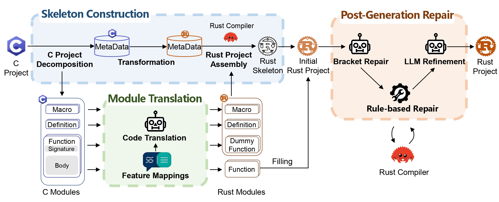
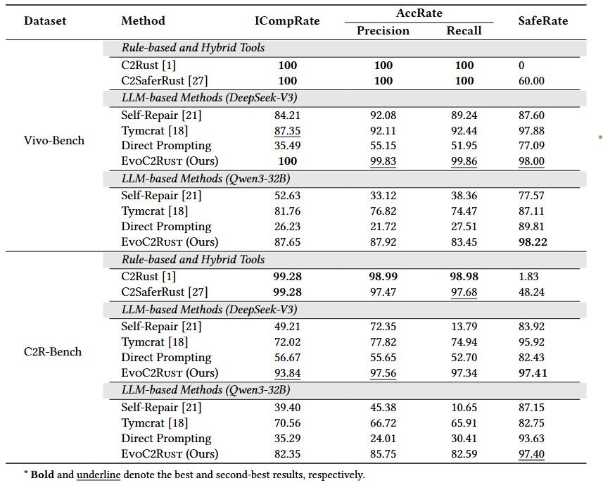
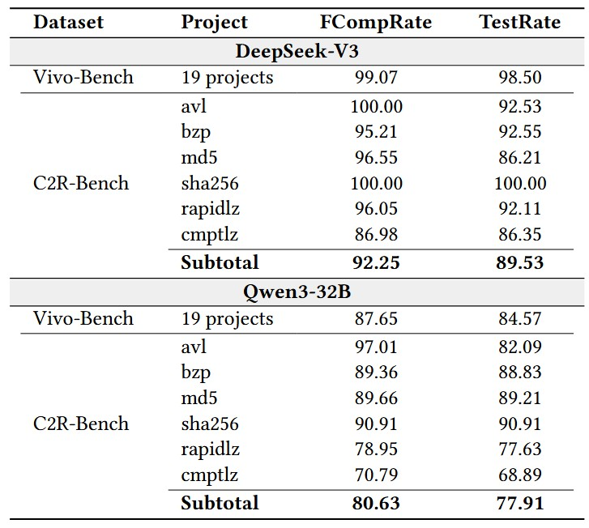
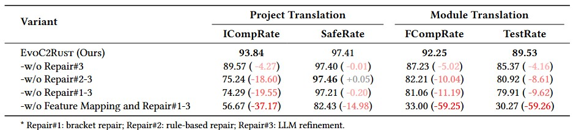
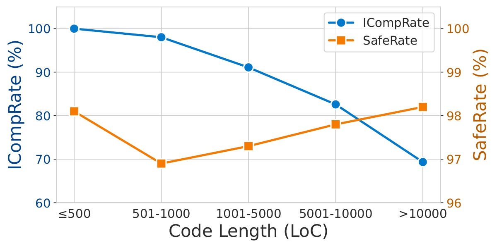
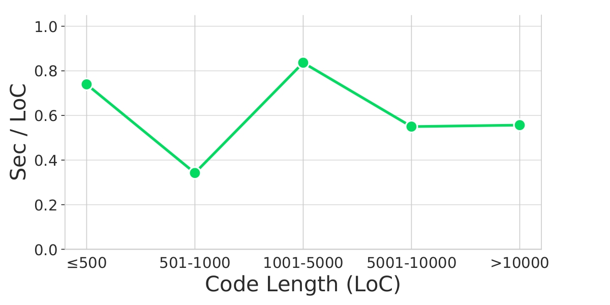

<div align="center">

# EvoC2Rust: A Skeleton-guided Framework for Project-Level C-to-Rust Translation

</div>

An automated framework for converting complete C projects to equivalent Rust ones.

## Project Directory Structure

```
.
├── data/                                   # Main data folder
│   ├── default/                            # Default data directory for script execution
│   │   ├── project/                        # Place projects to be translated here
│   │   ├── cache/                          # Caches for generated results
│   │   ├── c-metadata/                     # Stores parsed C metadata
│   │   └── rust-metadata/                  # Stores parsed Rust metadata
│   ├── increment/                          # data directory for incremental compilation
│   ├── fill/                               # data directory for fill-in-the-blank tests
│   └── project_template/                   # Sample project templates
│       ├── safelevel-0/                    # General project framework
│       └── safelevel-test/                 # Framework with unit tests
├── scripts/                                # Scripts for running the translation pipeline
├── experiment_scripts/                     # Scripts for reproducing experiments
├── src/                                    # Main source code directory
│   ├── config/                             # Global settings and prompt configurations
│   ├── cache/                              # Code cache management module
│   ├── code_optim/                         # Error repair and optimization module
│   ├── entity/                             # Core data structures and project management
│   ├── llm/                                # LLM API interaction module
│   └── metadata_extraction/                # C/Rust metadata extraction using tree-sitter
```

## Introduction

EvoC2Rust is an automated framework designed to convert complete C projects to equivalent Rust ones. It employs a skeleton-guided translation strategy for project-level translation. The pipeline consists of three stages:
  - It first decomposes the C project into functional modules, employs a feature-mapping-enhanced LLM to transform definitions and macros, and generates type-checked function stubs, which form a compilable Rust skeleton.
  - It then incrementally translates functions, replacing the corresponding stub placeholders.
  - Finally, it repairs compilation errors by integrating LLM and static analysis.


<div align="center">
    
    <p>EvoC2Rust System Architecture Overview</p>
</div>

## Getting Started

### Prerequisites
1.  Clone the repository:
    ```bash
    git clone https://github.com/your-username/evo-c2rust-v2.git
    cd evo-c2rust-v2
    ```
2.  Install system dependencies:
    - **Recommended: Using Nix**
    Use the `nix` package manager to create the required shell environment.
        ```bash
        # Create the required shell environment
        nix-shell
        # Install the Rust toolchain
        rustup toolchain install stable-gnu
        ```
    - **Alternative: Manual Installation**
      Install the following dependencies using your system's package manager: `python 3.11`, `clang-tools`, `gcc`, `cargo`, `rustc`.


### Installation

1.  Install the required Python packages:
    - **Recommended: Using PDM**
      ```bash
      # Create a temporary python environment and install EvoC2Rust
      pdm install
      ```
    - **Alternative: Using Pip**
      ```bash
      # Install EvoC2Rust into the system python environment
      pip install -e .
      ```

2.  Configure your LLM API key:
   You need to modify the configuration in the `config/llm_config.ini`.

    -  **Client Selection**:
        - If using the official DeepSeek model, ensure your import statement is `from llm.client import GenerationClient`.
        - If using the official qwen model, change it to `from llm.client_qwen import GenerationClient`.

## Usage

The default project directory is `./data/default/project`. Place the project you want to convert into this folder, then run the following scripts from the `scripts` directory.

### 1. Metadata Extraction

Run the script to extract metadata from your C project. This information will be stored for later stages.

```bash
python scripts/extract_metadata.py --project_name {name}
```
This will extract metadata from `./data/default/project/{name}` and save it to `./data/default/c_metadata/{name}` and `./data/default/rust_metadata/{name}`.

### 2. Translation

Translate the C code using the generation script.

```bash
python scripts/generate.py --project_name {name}
```
The script will translate the C code in the project and store the results in the cache directory specified within the script.

### 3. Repair

This multi-stage process fixes errors in the translated code.

-   **Bracket Mismatch Repair:**
    ```bash
    python scripts/delim_fix.py --project_name {name}
    ```
-   **Rule-Based Repair:**
    ```bash
    python scripts/rule_fix.py --project_name {name}
    ```
-   **LLM-Based Repair:**
    ```bash
    python scripts/rule_fix.py --project_name {name}
    ```
> **Note:** For repair scripts, pay attention to the `old_cache` and `new_cache` settings. The scripts read from the old cache, perform repairs, and save the updated results to the new cache.

### 4. Verification

Verify the correctness of the translated code through compilation and testing.

-   **Incremental Compilation:**
    ```bash
    python scripts/verify.py --project_name {name}
    ```
-   **Fill-in-the-Blank Compilation:**
    ```bash
    python scripts/fill_compile.py --project_name {name}
    ```
-   **Fill-in-the-Blank Testing:**
    ```bash
    python scripts/fill_test.py --project_name {name}
    ```
> **Note:** Fill-in-the-blank compilation and testing can only be performed on datasets with manually created ground truth. Fill-in-the-blank testing also requires manually created test cases.

### 5. Project Generation

Finally, generate the complete Rust project.

```bash
python scripts/gen_project.py --project_name {name}
```
The final, translated Rust project will be created in `./final_project/{name}`.

## Case Studies

The `case` directory contains detailed examples of how EvoC2Rust handles specific translation challenges:

- **[Red-Black Tree Rotation](case/case_study.md)**: We present a case study on the `rb_tree_rotate` function, a core operation in a red-black tree implementation, to illustrate the effectiveness of EvoC2Rust.
- **[Post-Generation Repair](case/post-generation_repair_case.md)**: We list an example of the full repair pipeline, showing how bracket repair, rule-based repair, and LLM refinement work together to fix a series of compilation errors.

## Results

### RQ1: How effectively does our method translate complete C projects to equivalent safe Rust code?

<div align="center">
    
</div>
Answer to RQ1: EvoC2Rust surpasses all baseline methods in project-level C-to-Rust translation, demonstrating the highest overall performance across compilation success, line acceptance, and code safety on both open-source and industrial benchmarks.

### RQ2: What is the module conversion accuracy achieved by our method?

<div align="center">
    
</div>
Answer to RQ2: Each component in EvoC2Rust plays a crucial role in its overall performance. The feature mapping mechanism provides a safe and reliable basis by bridging C-to-Rust semantic gaps, while the cascading repair chain fixes remaining errors to maximize syntactic and semantic correctness.

### RQ3: To what extent do key components contribute to the overall performance of our method?

<div align="center">
    
</div>
Answer to RQ3: Each component in EvoC2Rust plays a crucial role in its overall performance. The feature mapping mechanism provides a safe and reliable basis by bridging C-to-Rust semantic gaps, while the cascading repair chain fixes remaining errors to maximize syntactic and semantic correctness.

### RQ4: How does our method scale to large projects in terms of accuracy, safety, and efficiency?

<div align="center">
    
</div>
<div align="center">
    
</div>
Answer to RQ4: Our method exhibits strong scalability on large-scale projects, maintaining resilient compilation rates, high safety guarantees, and stable efficiency without performance collapse.